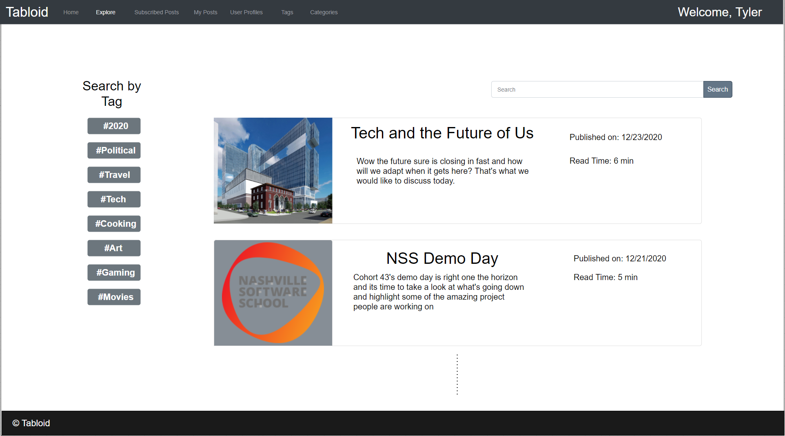

# Tabloid - Fullstack

## Description

A group project to build a full-stack website with a focus on authorization/authentication and CRUD functionality. In the form of an online news platform where users can create articles, comment on articles, classify the articles and tag the article.

## Team Members

Sidney Crandall, Bre Coach, Laurel Morrison, Nicholas Patton and myself Chadwell Clark.

I worked mainly on User functionality and setting up admin / user access constraints as well as helping everyone else. We had a really awesome team, with great communication and Team focus!

## To Use

1. Clone this repository.
1. Navigate to the Solution (.sln) file and open in Visual Studio.
1. Run the the two SQL scripts in order to create the dataset.
1. Set up a Firebase project with email / password authentication only.
1. Look at the SQL data for userProfiles and create firebase users for these emails.
1. Copy the firebaseUser UIDs into the datbase in place of the current firebaseUser UIDs.
1. Start the backend server and API by Running Tabloid.
1. Navigate to the folder that contains the package.json file.
1. Run npm install to load the depependencies.
1. Run npm start which will start the local server and enjoy this proof of concept application(Note our Sprint was only three days long. This was our first full stack application group Project. Pretty cool)

## Mock-Ups

### Login Page

### Home Page

### Explore Page

### Your Post's Page

### Create Post Form

### Post Details Page

### Category List Page

